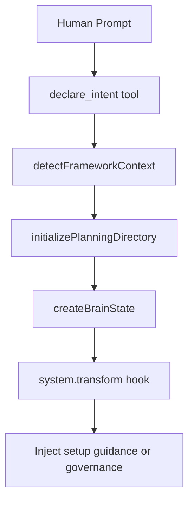
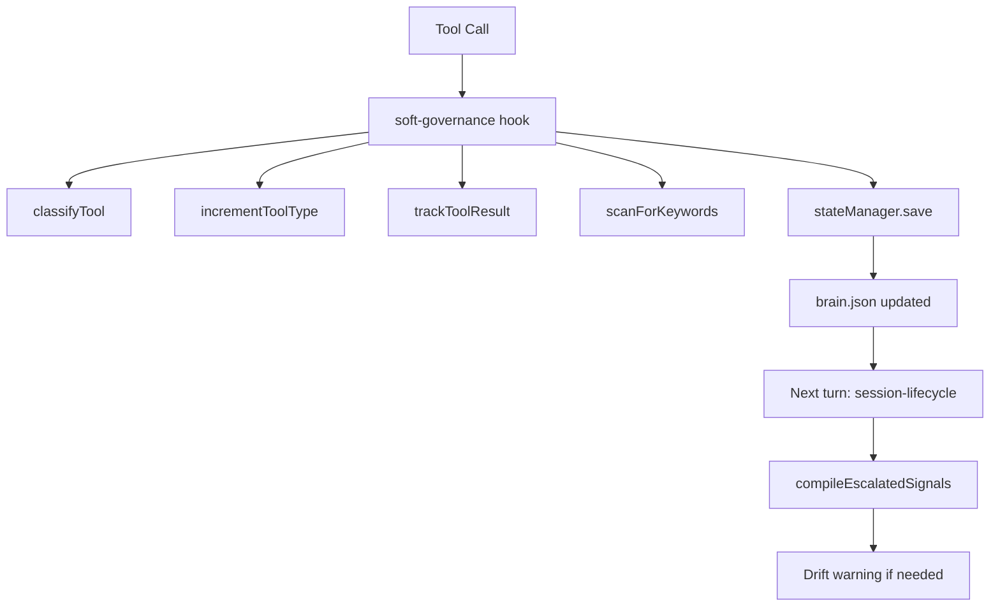
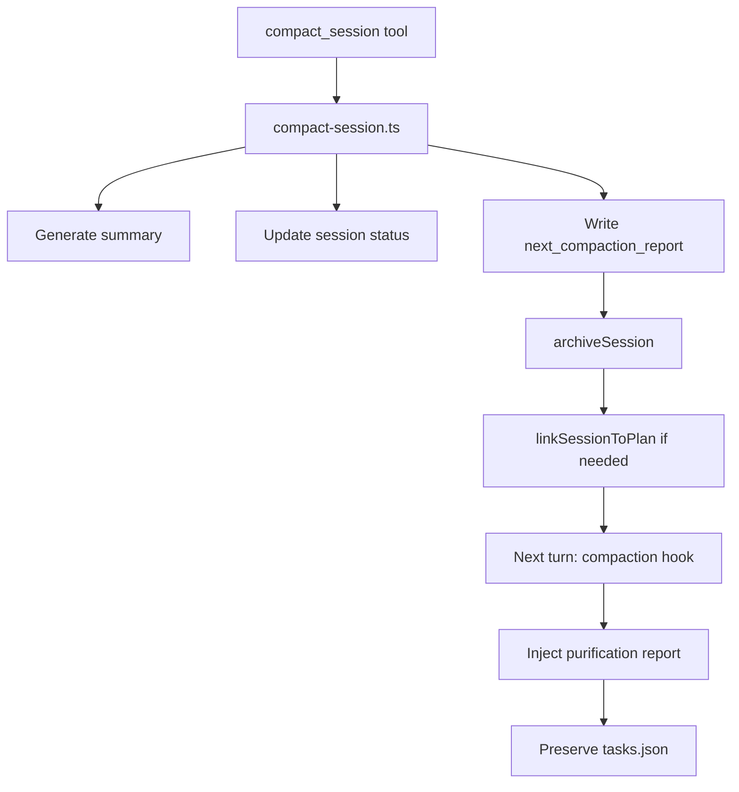

# HiveMind Concept-to-Implementation Mapping

**Date:** 2026-02-13  
**Plugin Version:** 2.6.0  
**Status:** MAPPING COMPLETE

---

This document maps the user's brainstorming concepts to the actual HiveMind implementation. It serves as the authoritative reference for validating end results against the original design intent.

---

## Section 1: Entity Hierarchy Mapping

### Level 0: GOVERNANCE SOT (Source of Truth)

```
Level 0: GOVERNANCE SOT
├── codemap/     → src/lib/paths.ts:120 (codemapDir)
│                 → src/lib/manifest.ts:88-93 (CodemapManifest type)
│                 STATUS: PLACEHOLDER - directories exist, no actual code scanning
└── codewiki/    → src/lib/paths.ts:121 (codewikiDir)
                  → src/lib/manifest.ts:95-100 (CodewikiManifest type)
                  STATUS: PLACEHOLDER - directories exist, no wiki synthesis
```

**Implementation Details:**

| Entity | Type Definition | Storage Path | Status |
|--------|----------------|--------------|--------|
| CodemapManifest | [`src/lib/manifest.ts:88-93`](src/lib/manifest.ts:88) | `.hivemind/codemap/manifest.json` | Placeholder |
| CodewikiManifest | [`src/lib/manifest.ts:95-100`](src/lib/manifest.ts:95) | `.hivemind/codewiki/manifest.json` | Placeholder |

### Level 1: PLANS

```
Level 1: PLANS
├── PlanManifest      → src/lib/manifest.ts:79-81 (PlanManifest)
├── Plan storage      → .planning/phases/ (filesystem)
└── Plan linking      → linkSessionToPlan() in src/lib/manifest.ts:354-396
```

**Implementation Details:**

| Entity | Type Definition | Storage Path | Functions |
|--------|----------------|--------------|-----------|
| PlanManifest | [`src/lib/manifest.ts:79-81`](src/lib/manifest.ts:79) | `.hivemind/plans/manifest.json` | `linkSessionToPlan()`, `registerSessionInManifest()` |
| Plan storage | N/A | `.planning/phases/` | External filesystem |

### Level 2: SESSIONS

```
Level 2: SESSIONS
├── SessionManifest     → src/lib/manifest.ts:65-68 (SessionManifest)
├── Session files       → .hivemind/sessions/{stamp}.md
└── Session state       → brain.json.current_session (via session.id)
```

**Implementation Details:**

| Entity | Type Definition | Storage Path | Functions |
|--------|----------------|--------------|-----------|
| SessionManifest | [`src/lib/manifest.ts:65-68`](src/lib/manifest.ts:65) | `.hivemind/sessions/manifest.json` | `registerSessionInManifest()`, `deduplicateSessionManifest()` |
| Session files | N/A | `.hivemind/sessions/{stamp}.md` | `instantiateSession()`, `readSessionFile()`, `writeSessionFile()` |
| Session state | [`src/schemas/brain-state.ts:13-28`](src/schemas/brain-state.ts:13) | `.hivemind/state/brain.json` | Managed by persistence.ts |

### Level 3: TASKS

```
Level 3: TASKS
├── TaskManifest     → src/lib/manifest.ts:135-139 (TaskManifest)
├── Task storage     → .hivemind/state/tasks.json
└── Task schema      → TaskManifestEntry[] (src/lib/manifest.ts:122-133)
```

**Implementation Details:**

| Entity | Type Definition | Storage Path | Status |
|--------|----------------|--------------|--------|
| TaskManifest | [`src/lib/manifest.ts:135-139`](src/lib/manifest.ts:135) | `.hivemind/state/tasks.json` | Schema defined, not actively written |
| TaskManifestEntry | [`src/lib/manifest.ts:122-133`](src/lib/manifest.ts:122) | N/A | Defined but not populated |

### Level 4: SUB-TASKS

```
Level 4: SUB-TASKS
├── SubTaskManifestEntry → src/lib/manifest.ts:106-120
├── Fields:
│   ├── id              → string (unique identifier)
│   ├── stamp           → string (timestamp-based)
│   ├── status          → TaskStatus enum
│   ├── description     → string
│   ├── agent           → "main" | "subagent"
│   ├── tools_used      → string[] array
│   ├── files_touched   → Array<{path, action}> array
│   ├── linked_artifacts → string[] array
│   ├── started_at      → number (epoch ms)
│   ├── completed_at    → number (epoch ms, optional)
│   ├── commit_hash     → string (optional)
│   └── metadata_commit_count → number
└── Timestamp: created_at, updated_at (via started_at/completed_at)
```

**Implementation Details:**

| Field | Type | Source |
|-------|------|--------|
| id | `string` | [`src/lib/manifest.ts:107`](src/lib/manifest.ts:107) |
| stamp | `string` | [`src/lib/manifest.ts:108`](src/lib/manifest.ts:108) |
| status | `TaskStatus` | [`src/lib/manifest.ts:109`](src/lib/manifest.ts:109) |
| description | `string` | [`src/lib/manifest.ts:110`](src/lib/manifest.ts:110) |
| agent | `"main" \| "subagent"` | [`src/lib/manifest.ts:111`](src/lib/manifest.ts:111) |
| tools_used | `string[]` | [`src/lib/manifest.ts:112`](src/lib/manifest.ts:112) |
| files_touched | `Array<{path, action}>` | [`src/lib/manifest.ts:113`](src/lib/manifest.ts:113) |
| linked_artifacts | `string[]` | [`src/lib/manifest.ts:114`](src/lib/manifest.ts:114) |
| started_at | `number` | [`src/lib/manifest.ts:115`](src/lib/manifest.ts:115) |
| completed_at | `number?` | [`src/lib/manifest.ts:116`](src/lib/manifest.ts:116) |
| commit_hash | `string?` | [`src/lib/manifest.ts:117`](src/lib/manifest.ts:117) |

---

## Section 2: Sure-Hit Mechanisms Mapping

### Mechanism 1: tool.execute.after Tracking

- **Implementation**: [`src/hooks/soft-governance.ts:139-428`](src/hooks/soft-governance.ts:139)
- **Trigger**: Every tool call via OpenCode SDK hook
- **Output**: Writes to [`brain.json.metrics`](src/schemas/brain-state.ts:38-64)
- **Gap**: Should write to tasks.json instead of brain.json.metrics
- **Validation**: Tests track tool execution in `tests/integration.test.ts`

**Current Flow:**
```
Tool Call → soft-governance hook → classifyTool() → increment tool_type_counts
                                              → trackToolResult()
                                              → scanForKeywords()
                                              → stateManager.save() → brain.json
```

### Mechanism 2: system.transform → Context Injection

- **Implementation**: [`src/hooks/session-lifecycle.ts:394-768`](src/hooks/session-lifecycle.ts:394)
- **Trigger**: Every turn (experimental.chat.system.transform)
- **Output**: Injects `<hivemind>` block into system prompt
- **Budget**: 2500 chars normally, 4000 chars for bootstrap (first 2 turns)
- **Validation**: Tests verify prompt injection in `tests/auto-hooks-pure.test.ts`

**Current Flow:**
```
Every Turn → session-lifecycle hook → load brain.json
                                   → compileEscalatedSignals()
                                   → formatSignals()
                                   → output.system.push(<hivemind>...)
```

### Mechanism 3: Manifest Traversal

- **Implementation**: [`src/lib/manifest.ts:143-160`](src/lib/manifest.ts:143)
- **Functions**: `readManifest()`, `writeManifest()`
- **Trigger**: Any read/write to manifest files
- **Output**: Typed JSON manifests, no directory scanning
- **Validation**: `tests/manifest.test.ts`

**Current Flow:**
```
Any manifest access → readManifest<T>() / writeManifest<T>()
                   → JSON.parse() / JSON.stringify()
                   → Type validation via TypeScript
```

### Mechanism 4: Forced Micro-State-Commits

- **Implementation**: [`src/lib/persistence.ts:75-91`](src/lib/persistence.ts:75)
- **Trigger**: After each tool call via soft-governance hook
- **Output**: Writes to brain.json with .bak backup
- **Validation**: State persists across tool calls

**Current Flow:**
```
Tool completion → soft-governance:412 → stateManager.save()
                                      → create backup .bak
                                      → write brain.json
```

### Mechanism 5: Schema Validation + Dedup

- **Implementation**: [`src/lib/manifest.ts:268-304`](src/lib/manifest.ts:268)
- **Function**: `deduplicateSessionManifest()`
- **Trigger**: When writing session manifest
- **Output**: Cleaned manifest with deduped entries
- **Validation**: `tests/manifest.test.ts` - dedup tests

**Current Flow:**
```
Write session manifest → deduplicateSessionManifest()
                       → normalizeSessionEntry()
                       → mergeSessionEntry() for conflicts
                       → rankStatus() for priority
```

### Mechanism 6: Purification on Compact

- **Implementation**: [`src/hooks/compaction.ts:52-60`](src/hooks/compaction.ts:52)
- **Trigger**: After `compact_session` tool is called
- **Output**: `brain.next_compaction_report` injected into next context
- **Validation**: `tests/compact-purification.test.ts`

**Current Flow:**
```
compact_session tool → write next_compaction_report
                    → next turn: compaction hook
                    → output.context.push(report)
                    → clear next_compaction_report
```

---

## Section 3: Entry Points Flow Documentation

### Entry 1: New Session

```
1. Human prompt → declare_intent tool
2. Detection   → src/lib/framework-context.ts:detectFrameworkContext()
3. Context pull→ src/hooks/session-lifecycle.ts:287-335 (setup guidance)
4. Plan injection → system.transform hook
```

**Flow Diagram:**


### Entry 2: Between Turns

```
1. Tool call → tool.execute.after hook
2. Tracking  → brain.json.metrics (soft-governance.ts)
3. Drift check → check_drift tool
4. Auto-commit → shouldSuggestCommit() - PARTIAL implementation
```

**Flow Diagram:**


### Entry 3: After First Compact

```
1. compact_session tool called
2. Purification → src/hooks/compaction.ts
3. Task preservation → tasks.json survives (not implemented)
4. Plan links updated → linkSessionToPlan()
```

**Flow Diagram:**


### Entry 4: After 3+ Compacts

```
STATUS: MISSING

Needed implementations:
1. Threshold detection in compaction.ts
   - Check brain.json.compaction_count >= 3
   
2. Manifest-only traversal mode
   - Skip detailed hierarchy tree
   - Use session manifest summaries only
   
3. Aggressive summarization
   - Compress context to <1000 chars
   - Prioritize: current task, pending subtasks, plan links
```

---

## Section 4: Human Intention Types Mapping

| Intention Type | Detection Mechanism | Tools Used | Output Location |
|---------------|---------------------|------------|-----------------|
| Research/Investigate | complexity analysis | scan_hierarchy, think_back | Anchors + mems |
| Implement/Fix | intent detection | declare_intent, map_context | Code changes + brain.json |
| Plan | plan_driven mode | declare_intent, export_cycle | Plan artifacts in .planning/ |
| Validate | self_rate | self_rate, check_drift | Quality metrics in brain.json |
| Explore | exploration mode | scan_hierarchy, recall_mems | Session log |

### Detection Details

**Research/Investigate:**
- Detection: [`src/lib/complexity.ts`](src/lib/complexity.ts) - complexity analysis
- Tools: [`scan_hierarchy`](src/tools/scan-hierarchy.ts), [`think-back`](src/tools/think-back.ts)
- Output: Anchors in `.hivemind/state/anchors.json`, Mems in `.hivemind/memory/mems.json`

**Implement/Fix:**
- Detection: [`declare_intent`](src/tools/declare-intent.ts) tool with mode detection
- Tools: [`declare_intent`](src/tools/declare-intent.ts), [`map-context`](src/tools/map-context.ts)
- Output: Brain state updates, hierarchy tree modifications

**Plan:**
- Detection: Mode = "plan_driven" in declare_intent
- Tools: [`declare_intent`](src/tools/declare-intent.ts), [`export-cycle`](src/tools/export-cycle.ts)
- Output: Plan artifacts in `.planning/phases/`, session-plan links

**Validate:**
- Detection: [`self_rate`](src/tools/self-rate.ts) tool invocation
- Tools: [`self_rate`](src/tools/self-rate.ts), [`check-drift`](src/tools/check-drift.ts)
- Output: Self-ratings stored in `brain.json.metrics.ratings[]`

---

## Section 5: Sub-Task Atomic Commit Requirements

### Current Implementation Status

| Requirement | Status | Implementation |
|-------------|--------|----------------|
| Timestamping | IMPLEMENTED | `started_at`, `completed_at` fields in SubTaskManifestEntry |
| Schema Connection | IMPLEMENTED | `linked_artifacts`, `parent_task` references |
| Atomic Commit | PARTIAL | Backup system in [`persistence.ts:78-86`](src/lib/persistence.ts:78) |
| File Changes | IMPLEMENTED | `files_touched[]` array |
| Agent Tracking | IMPLEMENTED | `agent` field ("main" \| "subagent") |
| Tool History | IMPLEMENTED | `tools_used[]` array |

### Detailed Requirements

```markdown
### Sub-Task Requirements

1. **Timestamping**: created_at, updated_at fields (ISO 8601)
   - Current: `started_at: number` (epoch ms), `completed_at?: number`
   - Source: [`src/lib/manifest.ts:115-116`](src/lib/manifest.ts:115)

2. **Schema Connection**: parent_task, session_id, plan_id
   - Current: `linked_artifacts: string[]` in SubTaskManifestEntry
   - Also: `session_stamp` in TaskManifestEntry
   - Source: [`src/lib/manifest.ts:114, 127`](src/lib/manifest.ts:114)

3. **Atomic Commit**: 
   - Current: Backup system in [`persistence.ts`](src/lib/persistence.ts:78-86)
   - Method: copyFile to .bak before write
   - Gap: Not true atomic (rename over existing not atomic on all filesystems)
   - Needed: True atomic write with temp+rename

4. **File Changes**: files_touched[] array
   - Current: `Array<{ path: string; action: FileAction }>`
   - Source: [`src/lib/manifest.ts:113`](src/lib/manifest.ts:113)

5. **Agent Tracking**: agent field
   - Current: `"main" | "subagent"` enum
   - Source: [`src/lib/manifest.ts:111`](src/lib/manifest.ts:111)

6. **Tool History**: tools_used[] array
   - Current: `string[]` of tool names
   - Source: [`src/lib/manifest.ts:112`](src/lib/manifest.ts:112)
```

---

## Section 6: Planning Artifacts Structure

### Current Implementation Status

| Requirement | Status | Implementation |
|-------------|--------|----------------|
| Hierarchical | IMPLEMENTED | Phase → Task → Sub-task in schema |
| Schema Regulated | IMPLEMENTED | YAML frontmatter + structured sections |
| Traversable | IMPLEMENTED | Manifest CRUD in manifest.ts |
| Sectional Updates | IMPLEMENTED | appendToSessionLog, updateSessionHierarchy |
| Session Lifecycle | IMPLEMENTED | archiveSession, resetActiveMd |

### Detailed Requirements

```markdown
### Planning Artifact Requirements

1. **Hierarchical**: Phase → Task → Sub-task
   - Current: TaskManifestEntry contains SubTaskManifestEntry[]
   - Source: [`src/lib/manifest.ts:122-139`](src/lib/manifest.ts:122)

2. **Schema Regulated**: YAML frontmatter + structured sections
   - Current: YAML frontmatter in session files
   - Source: [`src/lib/planning-fs.ts:87-108`](src/lib/planning-fs.ts:87)
   - Template sections: ## Hierarchy, ## Log, ## Notes

3. **Traversable**: Scripts can parse without AI
   - Current: JSON manifests + Markdown session files
   - Source: [`src/lib/manifest.ts:143-160`](src/lib/manifest.ts:143)

4. **Sectional Updates**: Partial updates supported
   - Current: appendToSessionLog(), updateSessionHierarchy()
   - Source: [`src/lib/planning-fs.ts:316-392`](src/lib/planning-fs.ts:316)

5. **Session Lifecycle**: Closed with session, resume on reopen
   - Current: archiveSession(), readActiveMd() on resume
   - Source: [`src/lib/planning-fs.ts:514-557`](src/lib/planning-fs.ts:514)
```

---

## Section 7: Validation Criteria Checklist

## End Result Validation Checklist

### Entity Hierarchy

- [ ] Level 0 (codemap/codewiki) directories exist with manifests
  - Path: `.hivemind/codemap/manifest.json`, `.hivemind/codewiki/manifest.json`
  - Source: [`src/lib/paths.ts:120-121`](src/lib/paths.ts:120)

- [ ] Level 1 (plans) have bidirectional session linking
  - Function: [`linkSessionToPlan()`](src/lib/manifest.ts:354)
  - Tests: `tests/manifest.test.ts`

- [ ] Level 2 (sessions) have proper manifest entries
  - Type: [`SessionManifestEntry`](src/lib/manifest.ts:54)
  - Storage: `.hivemind/sessions/manifest.json`

- [ ] Level 3 (tasks) stored in tasks.json
  - Path: `.hivemind/state/tasks.json`
  - Type: [`TaskManifest`](src/lib/manifest.ts:135)

- [ ] Level 4 (sub-tasks) have all required fields
  - Type: [`SubTaskManifestEntry`](src/lib/manifest.ts:106)
  - Fields: id, stamp, status, description, agent, tools_used, files_touched, linked_artifacts, started_at, completed_at

### Sure-Hit Mechanisms

- [ ] Every tool call is tracked
  - Hook: [`soft-governance.ts`](src/hooks/soft-governance.ts:139)
  - Writes to: brain.json.metrics

- [ ] Context injected every turn
  - Hook: [`session-lifecycle.ts`](src/hooks/session-lifecycle.ts:394)
  - Budget: 2500 chars (4000 for bootstrap)

- [ ] Manifests are single source of truth
  - Functions: [`readManifest()`](src/lib/manifest.ts:143), [`writeManifest()`](src/lib/manifest.ts:155)
  - No directory scanning for data

- [ ] State commits after significant events
  - Function: [`stateManager.save()`](src/lib/persistence.ts:75)
  - Trigger: After every tool call

- [ ] Schema validation rejects corrupt data
  - Function: [`deduplicateSessionManifest()`](src/lib/manifest.ts:268)
  - TypeScript provides compile-time validation

- [ ] Purification preserves tasks.json
  - Hook: [`compaction.ts`](src/hooks/compaction.ts:52)
  - Field: `next_compaction_report`

### Entry Points

- [ ] New session detects brownfield
  - Function: [`detectFrameworkContext()`](src/lib/framework-context.ts)
  - Hook: [`session-lifecycle.ts:287-335`](src/hooks/session-lifecycle.ts:287)

- [ ] Between turns tracks tools
  - Hook: [`soft-governance.ts`](src/hooks/soft-governance.ts:139)
  - Metrics: tool_type_counts, consecutive_failures

- [ ] First compact preserves tasks
  - Hook: [`compaction.ts`](src/hooks/compaction.ts:52)
  - Report: `next_compaction_report`

- [ ] 3+ compacts triggers aggressive mode
  - STATUS: **MISSING**
  - Needed: Threshold check in compaction hook
  - Field: `brain.json.compaction_count`

### Sub-Tasks

- [ ] All sub-tasks timestamped
  - Fields: `started_at`, `completed_at`
  - Type: epoch milliseconds

- [ ] Schema connections valid
  - Fields: `linked_artifacts`, `session_stamp`
  - References: PlanManifest, SessionManifest

- [ ] Atomic commits working
  - Current: Backup system (.bak files)
  - Gap: Not true atomic on all filesystems

- [ ] File changes tracked
  - Field: `files_touched[]`
  - Type: `Array<{path: string, action: FileAction}>`

- [ ] Agent attribution present
  - Field: `agent`
  - Values: `"main" | "subagent"`

---

## Appendix: Key File References

| File | Purpose |
|------|---------|
| [`src/lib/manifest.ts`](src/lib/manifest.ts) | Typed manifest schemas and CRUD |
| [`src/lib/paths.ts`](src/lib/paths.ts) | Centralized path resolution |
| [`src/lib/persistence.ts`](src/lib/persistence.ts) | Brain state persistence |
| [`src/lib/planning-fs.ts`](src/lib/planning-fs.ts) | Session file management |
| [`src/lib/hierarchy-tree.ts`](src/lib/hierarchy-tree.ts) | Hierarchy tree management |
| [`src/hooks/session-lifecycle.ts`](src/hooks/session-lifecycle.ts) | System prompt injection |
| [`src/hooks/soft-governance.ts`](src/hooks/soft-governance.ts) | Tool execution tracking |
| [`src/hooks/compaction.ts`](src/hooks/compaction.ts) | Post-compaction context |
| [`src/schemas/brain-state.ts`](src/schemas/brain-state.ts) | Brain state schema |
| [`.planning/VALIDATION-REPORT.md`](.planning/VALIDATION-REPORT.md) | Implementation validation report |

---

*This mapping document was created by analyzing the source code implementation against the user's brainstorming requirements. All file:line references point to the current codebase as of v2.6.0.*
